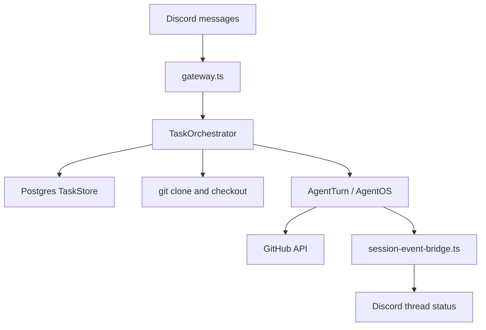

<div align="center">

# Threadcord

**Self-hosted Discord control plane for AgentOS coding-agent sessions**

`threadcord` · Node 22+ · Postgres · AgentOS · discord.js

</div>

> `/task create` opens a public thread on your reply, clones the requested GitHub repo into `/workspaces`, and runs an AgentOS agent turn. Postgres holds task state, follow-ups, and concurrency slots. After a restart, tasks that were `running` are moved to `waiting` so follow-ups can continue.

Threadcord is a Discord bot plus a small Hono server. Use `/task create` to supply repo, branch, model, and instruction. The bot opens a thread on the command reply, clones the repo, and dispatches work to an AgentOS coding agent. Thread messages handle follow-ups; thread commands handle cancel and done.

Configuration lives in [`.env.example`](.env.example). Zod validation is in [`src/config.ts`](src/config.ts).

**[Get started](#getting-started)**

---

## Table of contents

- [Getting started](#getting-started)
- [Configure model providers](#configure-model-providers)
- [Message format](#message-format)
- [Setup profiles](#setup-profiles)
- [MCP tool servers](#mcp-tool-servers)
- [Why use Threadcord?](#why-use-threadcord)
- [Features](#features)
- [How it works](#how-it-works)
- [Data privacy](#data-privacy)

## Getting started

### 1. Discord bot

1. Create a bot in the Discord developer portal.
2. Turn on the **Message Content** intent.
3. Grant View Channel, Send Messages, Create Public Threads, Send Messages in Threads, Read Message History. Optionally grant Manage Messages so the bot can pin task header messages — pinning is best-effort and task operation works without it.
4. Copy the bot token into `.env` as `DISCORD_BOT_TOKEN`. Invite the bot where you will use `/task` and `/setup`.

### 2. Docker Compose (recommended)

```bash
cp .env.example .env
# Discord, GitHub, provider keys
docker compose build
docker compose up
```

Compose brings up Postgres and the app on port `3583`.

- `GET /health` returns 200 when Postgres is up, the Discord client is ready, and the AgentOS sidecar is reachable.
- `GET /health/live` checks Postgres and the AgentOS sidecar.
- Default port is `3583`.

Health check:

```bash
curl http://localhost:3583/health
```

Liveness (Postgres + AgentOS sidecar):

```bash
curl http://localhost:3583/health/live
```

### 3. Local development (optional)

```bash
cp .env.example .env
npm install
npm run dev
npm run check
npm run test
npm run build
```

`npm run dev` runs the TypeScript server with `tsx watch`. `npm run build` compiles to `dist/` with `tsc`. `npm start` runs the built server only.

## Configure model providers

Models are allowed when their provider is configured in `.env`. Discord tasks use `model: <provider>/<model-id>`.

### Built-in providers

| Provider  | Env vars                                | Discord example                      |
| --------- | --------------------------------------- | ------------------------------------ |
| anthropic | `ANTHROPIC_API_KEY`, `ANTHROPIC_MODELS` | `model: anthropic/claude-sonnet-4-5` |
| openai    | `OPENAI_API_KEY`, `OPENAI_MODELS`       | `model: openai/gpt-5-codex`          |

Threadcord resolves these from the provider configuration. Set the API key and a comma-separated model list. No extra registration code is needed.

### Custom providers

1. Add the provider ID to `PROVIDERS` (comma-separated for multiple).
2. Set `PROVIDER_<ID>_BASE_URL`, `PROVIDER_<ID>_API`, and `PROVIDER_<ID>_MODELS`. Optional `PROVIDER_<ID>_API_KEY` and `PROVIDER_<ID>_HEADERS`.
3. Normalise the ID for env var names: `my-gateway` becomes `PROVIDER_MY_GATEWAY_*`.
4. Use `model: <id>/<model-id>` in Discord, where `<model-id>` comes from `_MODELS`.

Example (local Ollama via OpenAI-compatible endpoint):

```env
PROVIDERS=ollama
PROVIDER_OLLAMA_BASE_URL=http://localhost:11434/v1
PROVIDER_OLLAMA_API=openai-completions
PROVIDER_OLLAMA_MODELS=llama3.1:8b
```

Common `api` values: `openai-completions`, `openai-responses`, `anthropic-messages`. The AgentOS Pi software uses these protocol shapes to talk to the provider endpoint.

To route a built-in provider through a proxy, list its ID in `PROVIDERS` and set `PROVIDER_<ID>_BASE_URL` (for example `PROVIDERS=anthropic` with `PROVIDER_ANTHROPIC_BASE_URL=...`). Threadcord writes a transport override to `<workspace>/.pi/agent/models.json` and sets `PI_CODING_AGENT_DIR=/workspace/.pi/agent` on the agentOS session so Pi merges the proxy endpoint with its built-in provider catalog. API keys stay in session env only — never on disk.

Use `PROVIDER_<ID>_HEADERS` for providers that require custom request headers. The value must be a JSON object with string values:

```env
PROVIDERS=agent-router
PROVIDER_AGENT_ROUTER_BASE_URL=https://router.example.com/v1
PROVIDER_AGENT_ROUTER_API=openai-completions
PROVIDER_AGENT_ROUTER_MODELS=gpt-5-codex
PROVIDER_AGENT_ROUTER_HEADERS={"User-Agent":"Threadcord"}
```

Inside Docker Compose, `localhost` in a provider URL points at the container, not your host. Use `host.docker.internal`, a Compose service name, or host networking.

Allowed models are derived at startup from these provider blocks. When a Discord task omits `model:`, the first configured model is used.

### Pi session files

Before each agent turn, Threadcord materializes Pi-native config on disk:

- `<checkout>/.pi/settings.json` — default provider/model for the task (always written)
- `<workspace>/.pi/agent/models.json` — transport overrides or custom providers (written when needed)

Secrets (`ANTHROPIC_API_KEY`, `OPENAI_API_KEY`, custom provider keys) are injected into the agentOS session env at runtime, not written into these files.

## Creating tasks

Run `/task create` in any channel where the bot can post and create threads.

1. An ephemeral message lists **ready setup profiles** in a dropdown (`owner/repo @ branch`). Discord modals only support text fields, not dropdowns, so repo and branch are chosen here (up to 25 profiles).
2. After you pick one, a modal asks for **model** and **task instruction** (model defaults to the first allowed model at startup).
3. The bot replies with a link to a new public thread. Progress and agent output stream there.

If no setup profile is ready, run `/setup create` first.

Coding agents normally create branches named `threadcord/<type>/<meaningful-name>` (for example `threadcord/feat/add-auth`). Push overrides are not exposed in the slash UI; use follow-up instructions in the thread if you need a specific push target. Only the task base branch and explicit `threadcord/*` branches are allowed as push targets.

Thread commands (in a Threadcord-created thread):

- `status` prints the current task status.
- `abort` or `/abort` stops the in-flight agent turn and cancels the task.
- `cancel` or `/cancel` cancels the task without failing the current turn (no further dispatches).
- `done` marks a `waiting` or `queued` task complete.

## Setup profiles

Threadcord stores durable setup profiles in its own Postgres database. A profile belongs to one normalized GitHub repository and one base branch. It contains an environment JSON recipe and Markdown memory for future coding agents.

Normal coding tasks require a ready setup profile. If a task targets a repository and branch without one, Threadcord rejects the task and tells the user to run setup first. Task workspaces can still expire. Setup profile data stays in Postgres.

Target repositories do not need Threadcord files. Setup does not require `.cursor`, `.threadcord`, `THREADCORD_SETUP.md`, `AGENTS.md`, or any committed compatibility file.

Setup environment JSON:

```json
{
  "install": "npm ci",
  "start": "",
  "checks": {
    "build": "npm run build",
    "test": "npm test",
    "lint": "npm run lint",
    "typecheck": "npm run check"
  },
  "requiredEnv": ["DATABASE_URL"],
  "requiredServices": ["postgres"]
}
```

`install` is an operator-owned shell command. Threadcord runs it with `bash -c`
on the initial task turn, so setup profiles can use project-specific bootstrap
commands and shell pipelines. Setup install uses the same non-login shell behavior
as agent commands, so workspace-local npm globals remain on `PATH`.

Promotion happens when the setup agent calls `save_threadcord_setup_profile`. That tool re-runs `install`, every stored `checks` command, and (when `start` is non-empty) a short smoke probe of `start` in the setup workspace. `checks` should be commands that passed in that workspace. If a useful command needs missing secrets or services, record the names in `requiredEnv`, `requiredServices`, and memory instead of saving a failing check unless you can make it pass during setup. `start` is optional; leave it empty if there is no long-running dev server to probe.

Threadcord scopes each setup and task workspace with its own `HOME`, npm global prefix, and cache directory. Commands such as `npm install -g <tool>` install into that workspace and put the workspace-local `bin` directory on `PATH`. Deleting the workspace deletes those globals.

Setup commands (Discord slash command `/setup` with subcommands; `repo` and `branch` are required options, optional `model` on create/update):

| Subcommand | Purpose                                                                                                                                                                                                       |
| ---------- | ------------------------------------------------------------------------------------------------------------------------------------------------------------------------------------------------------------- |
| `create`   | First-time setup when no profile exists, or when the profile is `failed`. Spawns a public thread on the slash command with a live agent log (same style as coding tasks).                                     |
| `update`   | Re-run setup when the profile is `ready` or `failed` (not while `running` or `updating`). Spawns a setup thread with live log.                                                                                |
| `status`   | Show profile status, revision, and last run state (ephemeral). Re-run anytime for a fresh snapshot; while setup is running, open the setup thread from your `create`/`update` command for the live agent log. |
| `view`     | View the active profile environment and memory (ephemeral).                                                                                                                                                   |
| `edit`     | Open a private draft editor with buttons and modals.                                                                                                                                                          |
| `export`   | Export environment JSON and memory Markdown as ephemeral attachments.                                                                                                                                         |
| `import`   | Import environment and/or memory attachments into a draft.                                                                                                                                                    |

Repository names are normalized to lowercase `owner/repo`. Coding tasks require a profile in `ready` status.

Draft edits are isolated from the active profile. Applying a draft increments the profile revision only if the active profile still matches the draft base revision. If someone changed the profile first, Threadcord reports a conflict and leaves the active profile unchanged.

Setup profiles store required environment variable names only. They must not contain secret values. Threadcord validates setup JSON and memory before saving, importing, or applying a draft. Draft `import` and `apply` perform structural validation only. They do not re-run commands because the setup workspace is gone.

During coding turns, the agent can call `append_threadcord_setup_memory` to append Markdown to the active profile memory (gotchas, stable fixes, operator preferences). Each append increments the profile revision; new tasks use the latest revision on admission. Follow-up turns in an existing task reload memory on the next dispatch. Appends do not change install or checks.

## MCP tool servers

Add external MCP (Model Context Protocol) tool servers at runtime via Discord. No `.env` changes or restarts needed.

| Command       | What it does                                                                                                      |
| ------------- | ----------------------------------------------------------------------------------------------------------------- |
| `/mcp add`    | Opens a modal to configure a server (id, URL, token, transport, headers). Validates the connection before saving. |
| `/mcp remove` | Removes a server by id. Closes the live connection and deletes from DB.                                           |
| `/mcp list`   | Lists configured servers (id, URL, transport). Tokens are never shown.                                            |

MCP servers are global — every task gets tools from all connected servers. Servers persist in Postgres and reconnect on restart.

## Why use Threadcord?

### Discord threads per task

Each control-channel message gets its own public thread. Status updates and follow-ups stay in that thread.

### Concurrency and follow-ups

`MAX_CONCURRENT_TASKS` caps parallel agent runs. Extra tasks queue. Follow-up messages in a thread queue behind the current turn. On each task’s **initial** turn only, Threadcord runs the profile’s `install` command in the task workspace before dispatching the coding agent (follow-up turns reuse the checkout without re-running install).

### You run the stack

Postgres, workspace volumes, and API keys stay on your machine or VPS.

## Features

| Capability | Where           | What happens                                                                  |
| ---------- | --------------- | ----------------------------------------------------------------------------- |
| New task   | Control channel | Thread created, repo cloned, first turn queued (requires ready setup profile) |
| Follow-up  | Task thread     | Instruction queued; runs when task is `waiting`                               |
| `status`   | Task thread     | Replies with current task status                                              |
| `abort`    | Task thread     | Stops in-flight agent work and cancels the task (`/abort` or `abort`)         |
| `cancel`   | Task thread     | Cancels task; current turn may finish; no further dispatches                  |
| `done`     | Task thread     | Marks task `completed` from `waiting` or `queued`                             |
| Open PR    | Agent tool      | `create_github_pull_request` after push                                       |
| Learn      | Agent tool      | `append_threadcord_setup_memory` after verified repo lessons                  |
| Setup      | `/setup` slash  | Durable per-repo profiles; see [Setup profiles](#setup-profiles)              |
| MCP tools  | `/mcp` slash    | Add, remove, and list global MCP tool servers at runtime                      |

## How it works



1. [`gateway.ts`](src/discord/gateway.ts) routes channel messages to task creation and thread messages to follow-ups.
2. [`orchestrator.ts`](src/task/orchestrator.ts) parses the message, creates the thread, bootstraps the workspace, and calls `AgentTurn.prompt()`.
3. [`store.ts`](src/task/store.ts) persists state and claims turns under a Postgres advisory lock.
4. [`agentturn/`](src/agentturn/) runs the AgentOS Pi coding agent with host bindings for git, GitHub PR, Discord posting, and MCP tools.
5. [`session-event-bridge.ts`](src/discord/session-event-bridge.ts) edits the thread status message from AgentOS session events.

## Data privacy

### Self-hosted

Task rows and cloned repos live in your Postgres and workspace volume. No third-party control plane.

### LLM providers

Agent turns send your instruction and repo context to whichever model you configured. Check that provider's data policy.

### Discord

Instructions and status lines post to your server. [`redact.ts`](src/util/redact.ts) strips token-shaped strings before send.

### GitHub

Clone, push, and PR creation use your `GITHUB_TOKEN`. Repo access is bounded by that token's scope. Limit who can run `/task create` and post in task threads accordingly.

## Troubleshooting

### Task header is not pinned

The bot needs the **Manage Messages** permission to pin the task header message. Without it, pinning fails silently (logged server-side) and the task continues normally. The header is still posted and editable — only the pin is missing.

### Restart leaves tasks in `waiting`

After a restart, tasks that were `running` are moved to `waiting`. If a Discord thread is no longer accessible (archived, deleted, or permissions changed), the restart notification for that task is logged and skipped. Other tasks and scheduler slots are unaffected.

### Agent turns end with generic failure

When the agent hits repeated tool validation errors (wrong argument schemas), the turn is aborted early to stop error spirals. Discord receives a generic failure message; detailed validation text stays in server logs. Adjust `AGENT_MAX_VALIDATION_FAILURES` in `.env` to tune the threshold.

## License

MIT. See [LICENSE](LICENSE).
