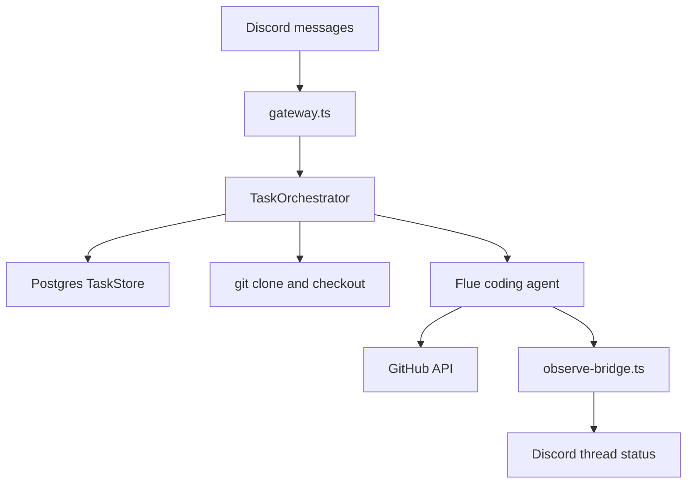

<div align="center">

# Threadcord

**Self-hosted Discord control plane for Flue coding-agent sessions**

`threadcord` · Node 22+ · Postgres · Flue · discord.js

</div>

> A message in your control channel opens a public thread, clones the requested GitHub repo into `/workspaces`, and runs a Flue agent turn. Postgres holds task state, follow-ups, and concurrency slots. After a restart, running tasks go back to `waiting`.

Threadcord is a Discord bot plus a small Hono server. You post a task with `repo`, `branch`, and optionally `model` fields. The bot replies in a thread, clones the repo, and dispatches work to a Flue coding agent. Thread commands handle follow-ups, cancel, and done.

Configuration lives in [`.env.example`](.env.example). Zod validation is in [`src/config.ts`](src/config.ts).

**[Get started](#getting-started)**

---

## Table of contents

- [Getting started](#getting-started)
- [Configure model providers](#configure-model-providers)
- [Message format](#message-format)
- [Setup profiles](#setup-profiles)
- [Why use Threadcord?](#why-use-threadcord)
- [Features](#features)
- [How it works](#how-it-works)
- [Data privacy](#data-privacy)

## Getting started

### 1. Discord bot

1. Create a bot in the Discord developer portal.
2. Turn on the **Message Content** intent.
3. Grant View Channel, Send Messages, Create Public Threads, Send Messages in Threads, Read Message History.
4. Copy the bot token and your control channel ID into `.env` as `DISCORD_BOT_TOKEN` and `DISCORD_CHANNEL_ID`.

### 2. Docker Compose (recommended)

```bash
cp .env.example .env
# Discord, GitHub, provider keys
docker compose build
docker compose up
```

Compose sets `THREADCORD_HTTP_BEARER` to `threadcord-dev-bearer` when `.env` leaves it blank. Change it before any network-exposed deploy.

- `GET /health` returns 200 when Postgres is up and the Discord client is ready.
- `GET /health/live` checks Postgres only.
- Default port is `3583`.
- Set `THREADCORD_HTTP_BEARER` before exposing the service. Required when `NODE_ENV=production`.

Health check:

```bash
curl http://localhost:3583/health
```

Liveness (Postgres only):

```bash
curl http://localhost:3583/health/live
```

### 3. Local development (optional)

```bash
cp .env.example .env
npm install
npm run dev
npm run check
npm run test
npm run build
```

`npm run dev` runs `flue dev`. Flue generates the Node server and dispatch wiring.

## Configure model providers

Models are allowed when their provider is configured in `.env`. Discord tasks use `model: <provider>/<model-id>`.

### Built-in providers

| Provider  | Env vars                                | Discord example                      |
| --------- | --------------------------------------- | ------------------------------------ |
| anthropic | `ANTHROPIC_API_KEY`, `ANTHROPIC_MODELS` | `model: anthropic/claude-sonnet-4-5` |
| openai    | `OPENAI_API_KEY`, `OPENAI_MODELS`       | `model: openai/gpt-5-codex`          |

Flue resolves these from its catalog. Set the API key and a comma-separated model list. No extra registration code is needed.

### Custom providers

1. Add the provider ID to `PROVIDERS` (comma-separated for multiple).
2. Set `PROVIDER_<ID>_BASE_URL`, `PROVIDER_<ID>_API`, and `PROVIDER_<ID>_MODELS`. Optional `PROVIDER_<ID>_API_KEY`.
3. Normalise the ID for env var names: `my-gateway` becomes `PROVIDER_MY_GATEWAY_*`.
4. Use `model: <id>/<model-id>` in Discord, where `<model-id>` comes from `_MODELS`.

Example (local Ollama via OpenAI-compatible endpoint):

```env
PROVIDERS=ollama
PROVIDER_OLLAMA_BASE_URL=http://localhost:11434/v1
PROVIDER_OLLAMA_API=openai-completions
PROVIDER_OLLAMA_MODELS=llama3.1:8b
```

Common `api` values: `openai-completions`, `openai-responses`, `anthropic-messages`. See the [Flue Provider API](https://github.com/withastro/flue/blob/main/apps/docs/src/content/docs/api/provider-api.md) for the full list.

To route a catalog provider through a proxy, list its ID in `PROVIDERS` and set `PROVIDER_<ID>_BASE_URL` (for example `PROVIDERS=anthropic` with `PROVIDER_ANTHROPIC_BASE_URL=...`). Flue layers your transport on the catalog.

Inside Docker Compose, `localhost` in a provider URL points at the container, not your host. Use `host.docker.internal`, a Compose service name, or host networking.

Allowed models are derived at startup from these provider blocks. When a Discord task omits `model:`, the first configured model is used.

## Message format

Put the instruction first. Add keyed fields at the bottom of the message.

```text
Fix the failing auth test and open a PR when done.

repo: owner/name
branch: main
model: anthropic/claude-sonnet-4-5
```

`model` is optional. If omitted, Threadcord uses the first model from your provider configuration (for example the first entry in `ANTHROPIC_MODELS` when Anthropic is configured first).

Coding agents normally create their own branches named `threadcord/<type>/<meaningful-name>` (for example `threadcord/feat/add-auth`). Optional push override:

```text
push: main
```

Only the task base branch and explicit `threadcord/*` branches are allowed as push targets. The legacy `agent/*` prefix is no longer accepted.

Thread commands (in a Threadcord-created thread):

- `status` prints the current task status.
- `cancel` stops further dispatches and frees a concurrency slot.
- `done` marks a `waiting` or `queued` task complete.

## Setup profiles

Threadcord stores durable setup profiles in its own Postgres database. A profile belongs to one normalized GitHub repository and one base branch. It contains an environment JSON recipe and Markdown memory for future coding agents.

Normal coding tasks require a ready setup profile. If a task targets a repository and branch without one, Threadcord rejects the task and tells the user to run setup first. Task workspaces can still expire. Setup profile data stays in Postgres.

Target repositories do not need Threadcord files. Setup does not require `.cursor`, `.threadcord`, `THREADCORD_SETUP.md`, `AGENTS.md`, or any committed compatibility file.

Setup environment JSON:

```json
{
  "install": "npm ci",
  "start": "",
  "checks": {
    "build": "npm run build",
    "test": "npm test",
    "lint": "npm run lint",
    "typecheck": "npm run check"
  },
  "requiredEnv": ["DATABASE_URL"],
  "requiredServices": ["postgres"]
}
```

`install` is an operator-owned shell command. Threadcord runs it with `bash -c`
on the initial task turn, so setup profiles can use project-specific bootstrap
commands and shell pipelines. Setup install uses the same non-login shell behavior
as agent commands, so workspace-local npm globals remain on `PATH`.

`/setup create` and `/setup update` promote a profile only after the save tool
verifies `install`, every stored `checks` command, and non-empty `start` smoke
behavior in the setup workspace. `checks` are commands that passed in that clean
workspace. If a useful command needs missing secrets or services, record the
names in `requiredEnv`, `requiredServices`, and memory instead of saving a
failing check unless you can make it pass during setup.

Threadcord scopes each setup and task workspace with its own `HOME`, npm global prefix, and cache directory. Commands such as `npm install -g <tool>` install into that workspace and put the workspace-local `bin` directory on `PATH`. Deleting the workspace deletes those globals.

Setup commands:

| Command | Purpose |
| ------- | ------- |
| `/setup create repo:<owner/repo> branch:<branch>` | Clone a setup workspace and dispatch the setup agent. |
| `/setup update repo:<owner/repo> branch:<branch>` | Re-run setup and promote only after verified commands succeed. |
| `/setup status repo:<owner/repo> branch:<branch>` | Show profile status, revision, and last run state. |
| `/setup view repo:<owner/repo> branch:<branch>` | View the active profile privately in Discord. |
| `/setup edit repo:<owner/repo> branch:<branch>` | Open a private draft editor with buttons and modals. |
| `/setup export repo:<owner/repo> branch:<branch>` | Export environment JSON and memory Markdown as private attachments. |
| `/setup import repo:<owner/repo> branch:<branch>` | Import JSON or Markdown attachments into a draft. |

Draft edits are isolated from the active profile. Applying a draft increments the profile revision only if the active profile still matches the draft base revision. If someone changed the profile first, Threadcord reports a conflict and leaves the active profile unchanged.

Setup profiles store required environment variable names only. They must not contain secret values. Threadcord validates setup JSON and memory before saving, importing, or applying a draft. Draft `import` and `apply` perform structural validation only. They do not re-run commands because the setup workspace is gone.

## Why use Threadcord?

### Discord threads per task

Each control-channel message gets its own public thread. Status updates and follow-ups stay in that thread.

### Concurrency and follow-ups

`MAX_CONCURRENT_TASKS` caps parallel agent runs. Extra tasks queue. Follow-up messages in a thread queue behind the current turn.

### You run the stack

Postgres, workspace volumes, and API keys stay on your machine or VPS.

## Features

| Capability | Where           | What happens                                       |
| ---------- | --------------- | -------------------------------------------------- |
| New task   | Control channel | Thread created, repo cloned, first turn queued     |
| Follow-up  | Task thread     | Instruction queued; runs when task is `waiting`    |
| `status`   | Task thread     | Replies with current task status                   |
| `cancel`   | Task thread     | Stops further dispatches, frees a concurrency slot |
| `done`     | Task thread     | Marks task `completed` from `waiting` or `queued`  |
| Open PR    | Agent tool      | `create_github_pull_request` after push            |

## How it works



1. [`gateway.ts`](src/discord/gateway.ts) routes channel messages to task creation and thread messages to follow-ups.
2. [`orchestrator.ts`](src/task/orchestrator.ts) parses the message, creates the thread, bootstraps the workspace, calls `dispatch`.
3. [`store.ts`](src/task/store.ts) persists state and claims turns under a Postgres advisory lock.
4. [`agents/coding.ts`](src/agents/coding.ts) runs the Flue agent with git/bash tools and the GitHub PR tool.
5. [`observe-bridge.ts`](src/discord/observe-bridge.ts) edits the thread status message from Flue events.

## Data privacy

### Self-hosted

Task rows and cloned repos live in your Postgres and workspace volume. No third-party control plane.

### LLM providers

Agent turns send your instruction and repo context to whichever model you configured. Check that provider's data policy.

### Discord

Instructions and status lines post to your server. [`redact.ts`](src/util/redact.ts) strips token-shaped strings before send.

### GitHub

Clone, push, and PR creation use your `GITHUB_TOKEN`. Repo access is bounded by that token's scope. Limit who can post in the control channel accordingly.

## License

MIT. See [LICENSE](LICENSE).
