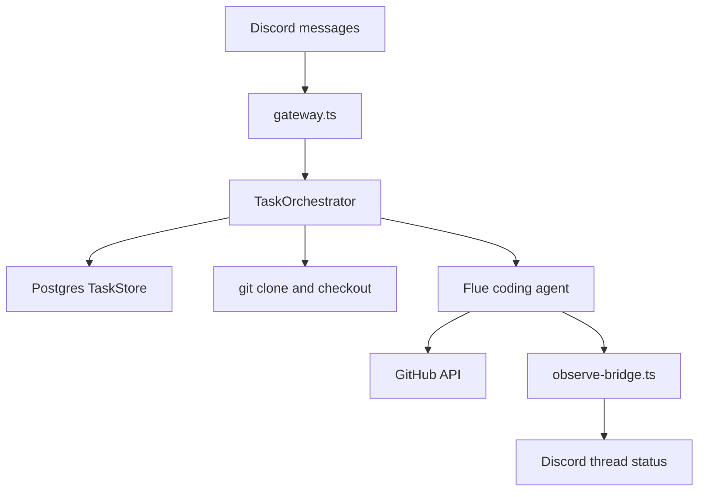

<div align="center">

# Threadcord

**Self-hosted Discord control plane for Flue coding-agent sessions**

`threadcord` · Node 22+ · Postgres · Flue · discord.js

</div>

> A message in your control channel opens a public thread, clones an allowed GitHub repo into `/workspaces`, and runs a Flue agent turn. Postgres holds task state, follow-ups, and concurrency slots. After a restart, running tasks go back to `waiting`.

Threadcord is a Discord bot plus a small Hono server. You post a task with `repo`, `branch`, and `model` fields. The bot replies in a thread, clones the repo, and dispatches work to a Flue coding agent. Thread commands handle follow-ups, cancel, and done.

Configuration lives in [`.env.example`](.env.example). Zod validation is in [`src/config.ts`](src/config.ts).

**[Get started](#getting-started)**

---

## Table of contents

- [Getting started](#getting-started)
- [Configure model providers](#configure-model-providers)
- [Message format](#message-format)
- [Why use Threadcord?](#why-use-threadcord)
- [Features](#features)
- [How it works](#how-it-works)
- [Data privacy](#data-privacy)

## Getting started

### 1. Discord bot

1. Create a bot in the Discord developer portal.
2. Turn on the **Message Content** intent.
3. Grant View Channel, Send Messages, Create Public Threads, Send Messages in Threads, Read Message History.
4. Copy the bot token and your control channel ID into `.env` as `DISCORD_BOT_TOKEN` and `DISCORD_CHANNEL_ID`.

### 2. Docker Compose (recommended)

```bash
cp .env.example .env
# Discord, GitHub, allowlists, provider keys
docker compose build
docker compose up
```

Compose sets `THREADCORD_HTTP_BEARER` to `threadcord-dev-bearer` when `.env` leaves it blank. Change it before any network-exposed deploy.

- `GET /health` returns 200 when Postgres is up and the Discord client is ready.
- `GET /health/live` checks Postgres only.
- Default port is `3583`.
- Set `THREADCORD_HTTP_BEARER` before exposing the service. Required when `NODE_ENV=production`.

Health check:

```bash
curl http://localhost:3583/health
```

Liveness (Postgres only):

```bash
curl http://localhost:3583/health/live
```

### 3. Local development (optional)

```bash
cp .env.example .env
npm install
npm run dev
npm run check
npm run test
npm run build
```

`npm run dev` runs `flue dev`. Flue generates the Node server and dispatch wiring.

## Configure model providers

| Provider    | Example model                 | Credentials                                            |
| ----------- | ----------------------------- | ------------------------------------------------------ |
| anthropic   | `anthropic/claude-sonnet-4-5` | `ANTHROPIC_API_KEY`                                    |
| openai      | `openai/gpt-5-codex`          | `OPENAI_API_KEY`                                       |
| opencode-go | `opencode-go/gpt-5-codex`     | `OPENCODE_GO_BASE_URL`, optional `OPENCODE_GO_API_KEY` |

List allowed models in `ALLOWED_MODELS`. Startup checks that each provider has its key set ([`assertProviderKeysForModels`](src/config.ts)).

### OpenCode Go

Threadcord registers an OpenAI-compatible provider named `opencode-go` when `OPENCODE_GO_BASE_URL` is set.

```env
OPENCODE_GO_BASE_URL=http://host.docker.internal:4096/v1
OPENCODE_GO_API_KEY=
ALLOWED_MODELS=opencode-go/gpt-5-codex
```

Use that model in Discord:

```text
Fix the issue and make a PR.

repo: owner/name
branch: main
model: opencode-go/gpt-5-codex
```

For OpenCode Go inside Docker, `localhost` points at the container, not your host. Use `host.docker.internal`, a Compose service name, or host networking.

## Message format

Put the instruction first. Add keyed fields at the bottom of the message.

```text
Fix the failing auth test and open a PR when done.

repo: owner/name
branch: main
model: anthropic/claude-sonnet-4-5
```

Optional push override:

```text
push: main
```

Only `agent/*` branches and the task base branch are allowed as push targets.

Thread commands (in a Threadcord-created thread):

- `status` prints the current task status.
- `cancel` stops further dispatches and frees a concurrency slot.
- `done` marks a `waiting` or `queued` task complete.

## Why use Threadcord?

### Discord threads per task

Each control-channel message gets its own public thread. Status updates and follow-ups stay in that thread.

### Repo allowlists

`ALLOWED_REPOS` accepts exact names (`owner/repo`) or prefixes (`owner/*`). Tasks outside the list are rejected before clone.

### Concurrency and follow-ups

`MAX_CONCURRENT_TASKS` caps parallel agent runs. Extra tasks queue. Follow-up messages in a thread queue behind the current turn.

### You run the stack

Postgres, workspace volumes, and API keys stay on your machine or VPS.

## Features

| Capability | Where           | What happens                                       |
| ---------- | --------------- | -------------------------------------------------- |
| New task   | Control channel | Thread created, repo cloned, first turn queued     |
| Follow-up  | Task thread     | Instruction queued; runs when task is `waiting`    |
| `status`   | Task thread     | Replies with current task status                   |
| `cancel`   | Task thread     | Stops further dispatches, frees a concurrency slot |
| `done`     | Task thread     | Marks task `completed` from `waiting` or `queued`  |
| Open PR    | Agent tool      | `create_github_pull_request` after push            |

## How it works



1. [`gateway.ts`](src/discord/gateway.ts) routes channel messages to task creation and thread messages to follow-ups.
2. [`orchestrator.ts`](src/task/orchestrator.ts) parses the message, creates the thread, bootstraps the workspace, calls `dispatch`.
3. [`store.ts`](src/task/store.ts) persists state and claims turns under a Postgres advisory lock.
4. [`agents/coding.ts`](src/agents/coding.ts) runs the Flue agent with git/bash tools and the GitHub PR tool.
5. [`observe-bridge.ts`](src/discord/observe-bridge.ts) edits the thread status message from Flue events.

## Data privacy

### Self-hosted

Task rows and cloned repos live in your Postgres and workspace volume. No third-party control plane.

### LLM providers

Agent turns send your instruction and repo context to whichever model you configured. Check that provider's data policy.

### Discord

Instructions and status lines post to your server. [`redact.ts`](src/util/redact.ts) strips token-shaped strings before send.

### GitHub

Clone, push, and PR creation use your `GITHUB_TOKEN`.

## License

MIT. See [LICENSE](LICENSE).
